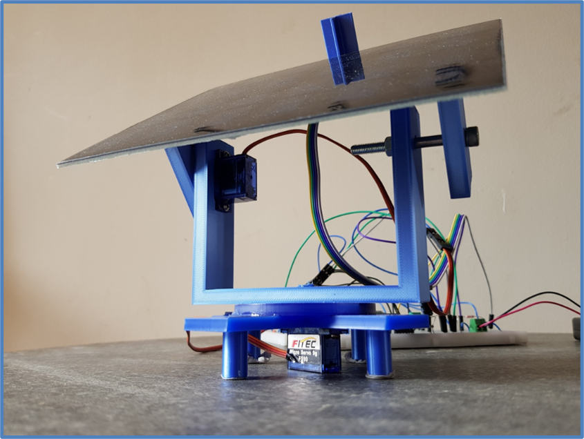
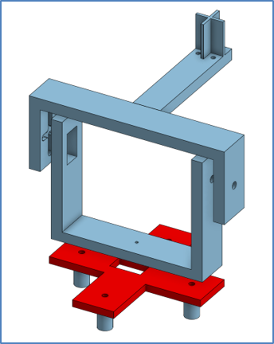
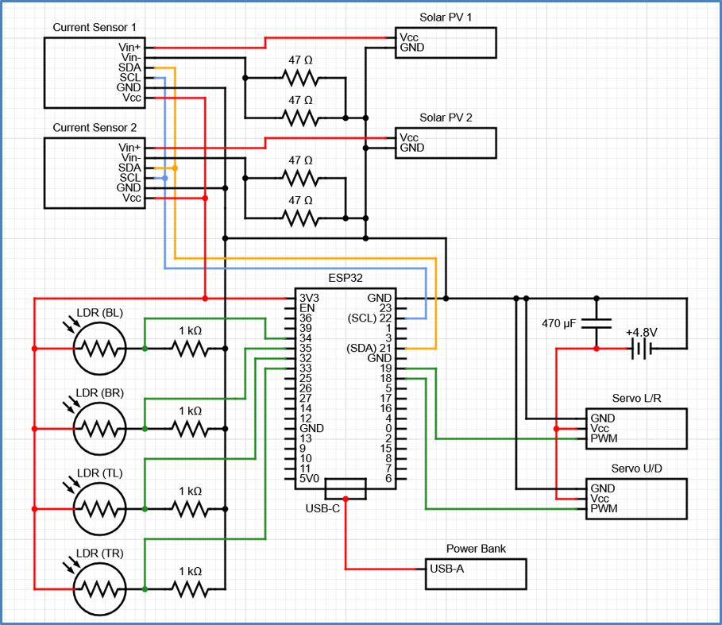
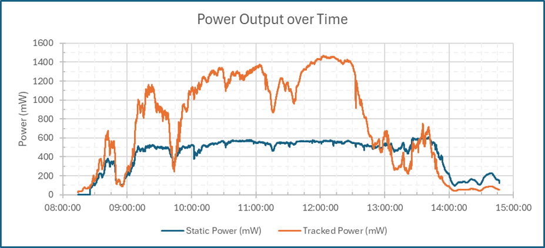
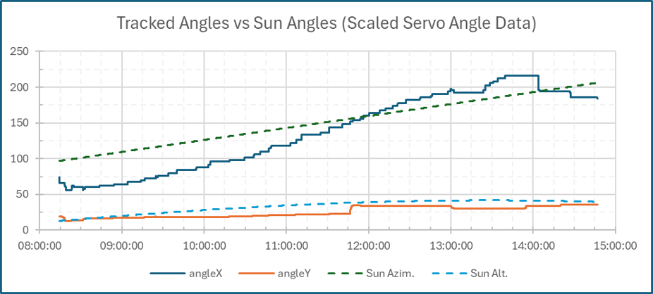

# esp32-dual-axis-solar-tracking-system

Project Title: Design, Assembly, and Performance Analysis of a Dual-Axis Sun-Tracking Solar Panel.
Overview

The aim of this project was to develop a prototype dual-axis sun-tracking system for a 1.5W, 6V solar PV panel, and to then
examine said panel’s power output performance compared to a non-tracked solar panel under real weather conditions in Dublin,
Ireland.

Features:
 -Dual-axis solar tracking
 -ESP32 control system
 -LDR-based sunlight detection
 -Servo motor positioning
 -Bluetooth telemetry
 -Power monitoring
 -3D-printed mount

Hardware Used:
 -ESP32
 -Servo motors
 -LDRs
 -Current sensors
 -Solar PV panels

Software Used:
 -Arduino IDE
 -Onshape

## Photo of Dual-Axis Sun-Tracking Mount

## CAD Design

## Wiring Diagram

## Graph of Power Output over Time for Dublin City on Thursday 02-Apr-2026

## Graph of Dual Axis Tracker Servo Angles VS Sun Location Data for Dublin City on Thursday 02-Apr-2026

Further details regarding this project can be found in the project report.
